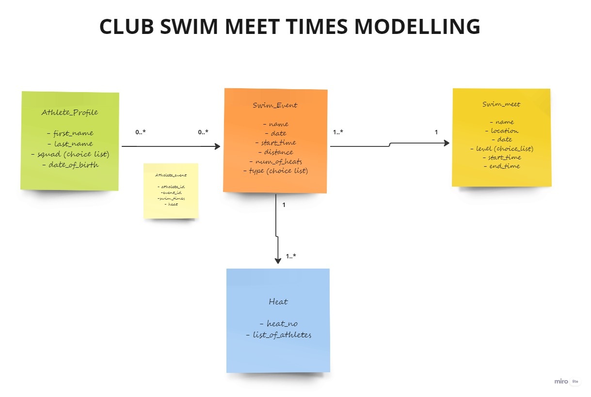

# Ringwood Swim club meet times app

This app will allow to keep a central record of meet times for athletes

### Why?

Currently the times for different meets are stored in excel sheet and times are registered on a pdf file.

This app will allow the admin to record the times on a central db.

The athletes and coaches can access their profile and see meet times (historical and latest)

The athletes can track their PB's based on events, distance and meets.

### Dependencies

- Django

- React + TS

- Open API generator

- HyperUI

### Getting Started

#### Server

> cd server/

- Install dependencies

`pipenv run install`

- Start server

` pipenv run python src/manage.py runserver localhost:8000`

#### Modelling

